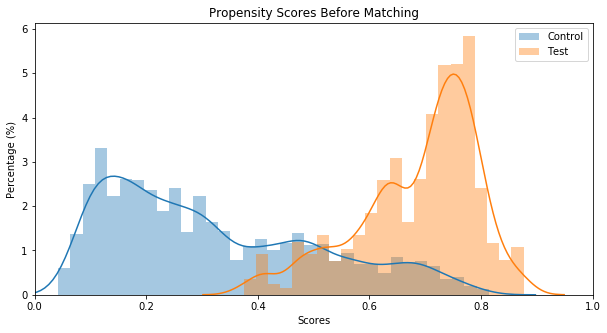
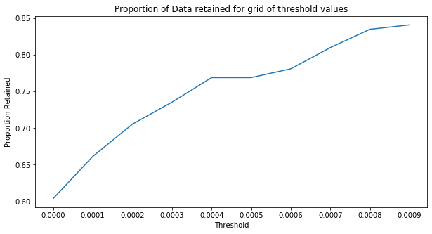

### psmatch 

本项目基于
pymatch  https://github.com/benmiroglio/pymatch 进行修改；原项目无法运行且无法联系创建人
本项目新增部分特性：

1. 模型可选择基于catboost的树模型（支持分类变量）和常见的线性模型
2. 模型增加并行计算功能，模型数量多的情况下加快执行速度
3. todo: match优化，a: 循环方式-低效; b: 有无放回实现;

psm算法简介：https://zhuanlan.zhihu.com/p/152200488


> PSM解决的是**选择偏差**问题（即控制混杂因素），倾向得分配比就是利用倾向评分值，从对照组中为处理做中的每个个体寻找一个或多个背景特征相同或相似的个体作为对照。这样就最大程度降低了其他混杂因素的干扰。

> 比如，想研究‘读研究生’对于收入的影响。一种简单的做法是直接对比‘读过’和‘没有读过’这两类群体的收入差异，但这种做法并不科学。因为还可能存在其他变量影响着研究结果，如性别，年龄，父母学历，父母是否做教育工作等因素都会干扰到研究。

> 因此，PSM正是为了减少这种干扰。PSM可实现找到类似的两类人，他们的基本特征都基本一致，主要区别在于‘是否读过’研究生。这样可减少干扰因素差异带来的数据偏差和混杂干扰。

------


#### 安装

```shell
pip install psmatch
```

版本还在持续更新，目前最新版本为0.0.3

#### 示例

载入包

```python
%load_ext autoreload
%autoreload 2
%matplotlib inline

import warnings
warnings.filterwarnings('ignore')
from psmatch.Matcher import Matcher
import pandas as pd
import numpy as np
```

读取文件

```python
path = "./misc/loan.csv"
data = pd.read_csv(path)
```

创建测试和控制组

```python
test = data[data.loan_status == "Default"]
control = data[data.loan_status == "Fully Paid"]
test['loan_status'] = 1
control['loan_status'] = 0
```

初始化Matcher

```python
m = Matcher(test, control, yvar="loan_status", exclude=[])
```
训练模型获取得分，在样本不均衡场景使用balance=True，model_type枚举值为"line" 和 "tree"

```python

np.random.seed(20210419)

m.fit_scores(balance=True, nmodels=10,n_jobs = 5,model_type='tree')
```


Average Accuracy: 86.64%，而线性模型同样数据集的表现为66%


树模型在准确率方面效果远超线性模型，优先建议使用树模型

预测得分、展示得分

```python
m.predict_scores()
m.plot_scores()
```



查找匹配阈值

```python
m.tune_threshold(method='random')
```



匹配数据

每次匹配会生成独立的match_id，用于标志一对唯一的匹配数据

```python
m.match(method="min", nmatches=1, threshold=0.0005)
```

输出匹配结果

```python
m.matched_data.sort_values("match_id").head(6)
```

|      | record_id | weight   | funded_amnt | funded_amnt_inv | grade | installment | int_rate | loan_amnt | loan_status | sub_grade | term      | scores   | match_id |
| ---- | --------- | -------- | ----------- | --------------- | ----- | ----------- | -------- | --------- | ----------- | --------- | --------- | -------- | -------- |
| 0    | 0         | 1        | 40000       | 40000           | B     | 867.71      | 10.90%   | 40000     | 1           | B4        | 60 months | 0.660292 | 0        |
| 2414 | 6440      | 0.076923 | 40000       | 40000           | B     | 867.71      | 10.90%   | 40000     | 0           | B4        | 60 months | 0.660292 | 0        |
| 1    | 1         | 1        | 10000       | 10000           | B     | 332.05      | 11.98%   | 10000     | 1           | B5        | 36 months | 0.489164 | 1        |
| 3002 | 12785     | 0.058824 | 10000       | 10000           | B     | 332.05      | 11.98%   | 10000     | 0           | B5        | 36 months | 0.489164 | 1        |
| 2    | 2         | 1        | 40000       | 40000           | B     | 1328.2      | 11.98%   | 40000     | 1           | B5        | 36 months | 0.784762 | 2        |
| 3085 | 14255     | 0.058824 | 40000       | 40000           | B     | 1328.2      | 11.98%   | 40000     | 0           | B5        | 36 months | 0.784762 | 2        |


匹配结果评估

离散变量,看各种占比 -> 覆盖率
```python
categorical_results = m.compare_categorical(return_table=True)
```
计算卡方分布

连续变量,经验累计分布函数ECDF
Empirical Cumulative Distribution Functions (ECDF)
经验累积分布函数(ECDF)


#### 常见问题

##### 为什么在PSM实践过程中,将倾向性得分模型从线性模型的66%准确率提升到了树模型76%准确率,匹配结果卡方校验和ks检验反而通不过了?

在PSM（Propensity Score Matching, 倾向性得分匹配）实践过程中，如果将倾向性得分模型从线性模型（如Logistic回归）的66%准确率提升到树模型（如随机森林或梯度提升树）的76%准确率后，匹配结果的卡方检验和KS检验反而通不过了，这可能与以下几点有关：

模型复杂度与过拟合：

树模型（如随机森林或梯度提升树）往往比线性模型更复杂，有更强的建模能力。在这个过程中，树模型可能会捕捉到数据中的噪声或过度反映训练数据集的特点，从而导致过拟合。这可能会导致倾向性得分预测结果在验证集或测试集上的表现不如训练集，影响匹配的质量。
数据平衡性：

线性模型倾向于更平滑地分布数据，而树模型可能会更加细化，从而导致倾向性得分的分布出现更大的差异。这会影响到匹配的质量，因为理想情况下，倾向性得分应该在处理组和对照组之间有良好的重叠。
倾向性得分的维数灾难：

树模型尤其是在高维数据上表现良好，但在倾向性得分匹配时，高维特征可能导致倾向性得分计算的复杂性增加，反而可能降低了匹配的有效性。
匹配算法的适应性差异：

储树模型可能会导致产生极端倾向得分（接近0或1），这些极端得分可能会导致匹配困难，因为匹配算法难以找到合适的匹配对，从而导致匹配失败。卡方检验和KS检验检测的正是这种情况。
变量重要性和选择：

树模型能够捕捉复杂的非线性关系，在这种过程中，有可能某些变量在树模型中获得了更高的权重，导致相匹配的倾向性得分发生了较大偏移，反而削弱了匹配的效果。
为了解决这一问题，可以考虑以下几点：

正则化方法：

通过正则化方法（如L1或L2正则化）来控制树模型的复杂性，减轻过拟合问题。
检查和调整模型超参数：

对树模型的超参数进行调整，例如树的深度、最小样本数等，以降低模型复杂度，避免过拟合。
平衡性检查：

在进行匹配之前，对倾向性得分进行进一步的检查和统计检验，确保两个组之间的得分分布接近平衡。
混合模型使用：

可以尝试使用混合模型，将树模型和线性模型结合起来使用，利用树模型捕捉复杂关系，将线性模型用于实际匹配。
调整匹配方法：

可以选择更健壮的匹配方法（如卡钳匹配、分层匹配或最近邻匹配）来提高匹配结果的平衡性和稳定性。
总之，模型复杂性提高后，在PSM的匹配过程中，检验通不过的现象往往源于模型过拟合和匹配质量的下降，需要通过多重方法来调整和优化。


##### 为什么PSM算法不用过于复杂的树模型,而使用线性模型?

在处理配对倾向评分（Propensity Score Matching, PSM）时，通常选择线性模型（如Logistic回归）而不使用过于复杂的树模型，这有几个主要原因：

**解释性：**

线性模型相对简单，结果更易于解释。对于政策评估或医学研究这样的领域，解读模型的结果往往是非常重要的。线性模型透明且直观，便于理解和沟通。

**减少过拟合：**

复杂的树模型（如随机森林或梯度提升树）可能容易捕捉训练数据中的噪声，导致过拟合。PSM的主要目的是平衡处理组和对照组，使其在协变量上尽可能相似，从而减少混淆因素的影响。

模型过于复杂可能导致评分不稳定，使得匹配效果变差。这对因果推断（因果效应估计）来说是不可取的。

**稳健性和泛化性：**

简单的线性模型通常泛化能力更好，更稳健。在许多实际应用中，线性模型已经足够提供合理的配对倾向评分，从而实现有效的匹配和后续分析。

**计算效率：**

线性模型的计算效率高，尤其是在处理大规模数据集时，这一点尤为重要。复杂的树模型训练时间较长，计算资源需求大，不适合某些实际应用场景。

**传统和经验：**

在许多传统研究中，经典的线性方法（如Logistic回归）已经被反复验证，具有良好的实用性和理论基础。这些方法在统计学领域有广泛的使用经验和理论支持。

尽管如此，有时在特定情境下，使用更复杂的模型可能是有益的，例如在高维数据或非线性关系突出的情况下。

但在多数情况下，出于上述原因，使用线性模型来计算配对倾向评分是一种较为保守且可靠的选择。

##### 特定数据集通用的GLM线性模型拟合效果非常差,accuracy 58%; KS和卡方都通不过,换成树模型就好了?
